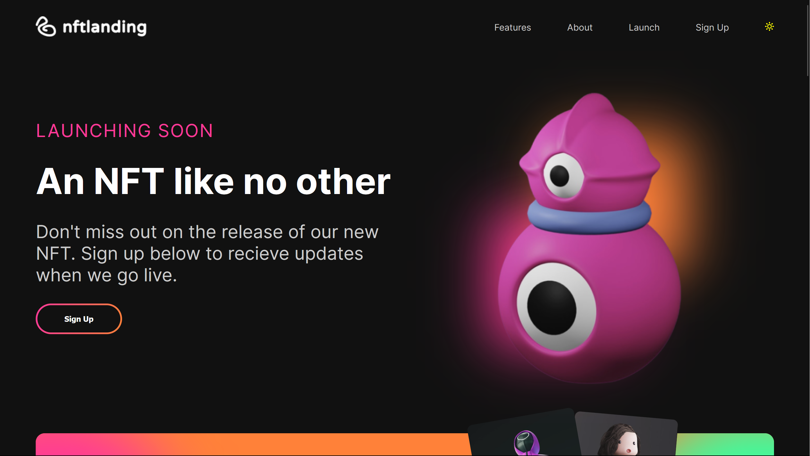

# nft-landing

NFT landing page using React.js with scrollreveal effect

</img>

<h3>🛠️ Installation Steps:</h3>

<p>1. Clone the repository</p>

```
git clone https://github.com/imgagandeep/nft-landing.git
```

<p>2. Install the required dependencies </p>

```
npm install
```

<p>3. Start the development server</p>

```
npm start
```

<p>4. Access the application at</p>

```
http://localhost:3000
```

<h3>💻 Built with</h3>

Technologies used in the project:

-   [React](#) - Building user interfaces
-   [scss](#) - For styling
-   [React Icons](#) - For icons
-   [ScrollReveal](#) - Use ScrollReveal effect
